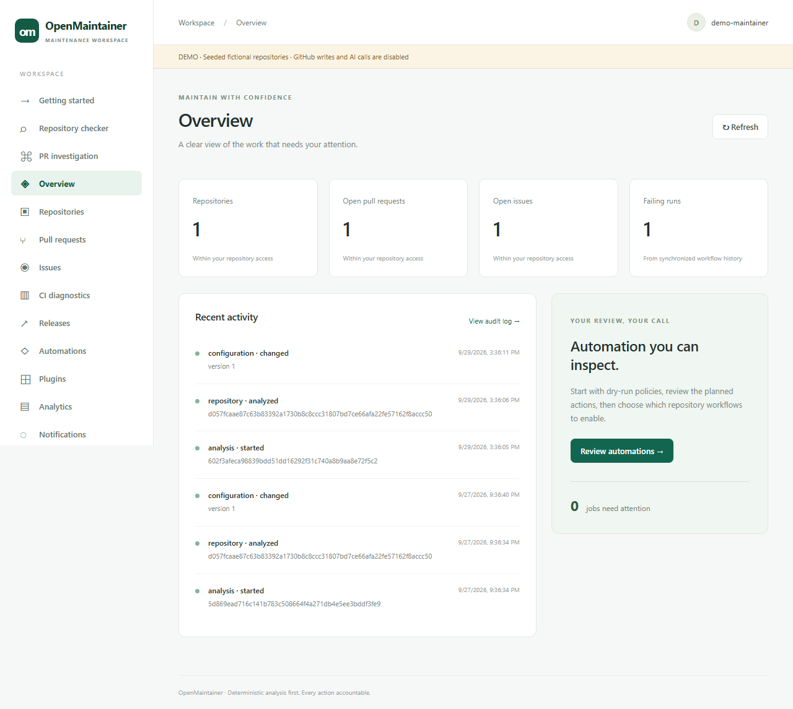
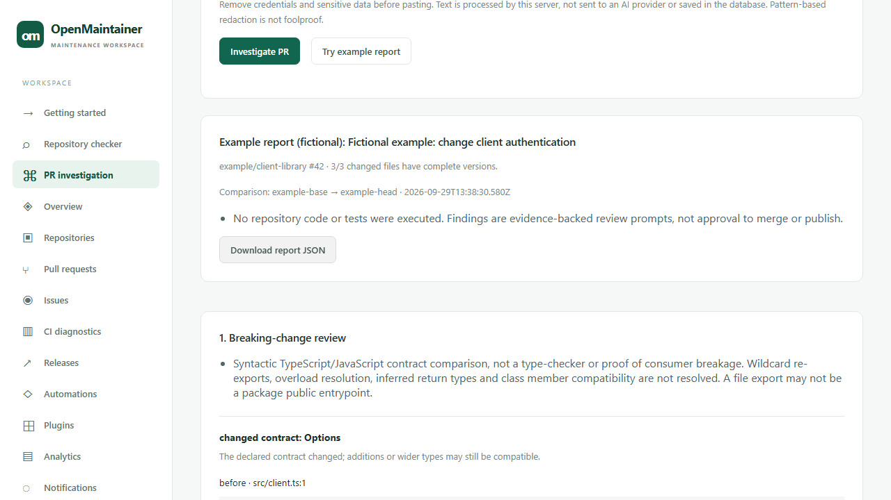

# OpenMaintainer

A self-hosted maintenance workbench for GitHub repositories. Inspect repository health, understand pull requests, triage issues, diagnose CI failures, and prepare release notes—with deterministic analysis first and explicit automation policies.

**Status: 0.1.0 initial implementation.** Not independently security-audited. Real GitHub App installation, OAuth and paid AI need your credentials and staging validation. No adoption or performance claims.



## Try it without credentials

Requires Node.js 24 and pnpm 11.15.1.

```sh
git clone https://github.com/hxracan/OpenMaintainer.git
cd OpenMaintainer
npm install --global pnpm@11.15.1
pnpm install --frozen-lockfile
pnpm demo
```

Open [localhost:3000](http://localhost:3000). The isolated demo uses embedded PostgreSQL under `.demo/`, fictional records, and the real API/worker. GitHub writes and OpenAI calls are disabled. The **Repository checker** makes anonymous read-only GitHub requests when you submit a public repository; its results are separate from the fictional demo records. Analyze the demo repository or issue to exercise the queue. Do not expose demo ports publicly.

## Investigate a pull request

Open **PR investigation** in the sidebar. Paste a public `https://github.com/owner/repository/pull/123` URL, optionally add a redacted CI log and an issue/reproduction description, then click **Investigate PR**. **Try example report** exercises all five engines offline with explicitly fictional inputs.

- **Breaking-change review:** compares explicit JS/TS exports, required arguments and fields, parameter defaults, exported literals, package entrypoints and JSON configuration values. Findings include base/head snippets and pinned source links.
- **Regression-test plan:** relates changed source to test filenames/imports, distinguishes changed from unchanged tests, and proposes arrange/act/assert review scenarios. It does not measure coverage or execute tests.
- **CI investigation:** groups supplied failure logs and connects exact changed-file paths to diagnostics, without claiming a proven cause or live CI status.
- **Release-risk checklist:** turns the inspected changes into compatibility, migration, dependency and testing tasks. It covers this PR, not every change since the last release.
- **Issue-to-code leads:** ranks exact paths, matching path terms and declaration names, with evidence and uncertainty.

Download the combined report as JSON. No AI key, GitHub App, or login is needed for public mode. Reports are not saved. Public inspection uses the PR's merge base and pinned head, supports up to 200 changed files, and fetches complete versions for the first eight eligible files (125 KB each); the report lists uninspected files. Expect up to 24 anonymous GitHub requests per report. This is a review assistant, not a compatibility proof, security audit or merge approval. [Detailed scope](docs/limitations.md).



## Check a public repository

Open **Repository checker** in the sidebar, paste `https://github.com/owner/repository` (or `owner/repository`), then click **Check repository**. No credentials or App installation are required. The report checks for README, license, contribution instructions, security policy, CODEOWNERS and CI workflow files, with explanations of missing items. It also identifies file extensions/languages and archived status.

This checks the default-branch file tree, not code correctness, file quality, dependency vulnerabilities or live CI results. It never executes repository code or saves/imports the repository. Private repositories use the authenticated GitHub App workflow. Anonymous GitHub limits apply; oversized/truncated trees are rejected rather than reported as complete.

## What works

- Repository inventory: languages, manifests, workspaces, frameworks and missing maintenance files.
- PR review: change scope, test-file signals, security-sensitive paths and potential TypeScript/API/config/migration breaks.
- Issue triage: reproduction gaps, staleness and transparent lexical duplicate candidates.
- CI diagnosis: redacted, bounded failure excerpts with evidence-backed investigation hints.
- Releases: conventional commits, Changesets, semantic-version recommendations and draft notes. Never publishes automatically.
- GitHub App: signed webhooks, installation synchronization, scoped OAuth access, durable jobs and audit records.
- Rules: versioned YAML, deterministic conditions, dry-run plans and guarded external actions with an ambiguity ledger.
- Dashboard: live repository/PR/issue/CI views, configuration, job status, notifications, analytics and analysis history.
- Guided onboarding, draft rule previews with condition explanations, issue duplicate checks, and searchable job cards with history and queued-job cancellation.
- Optional AI: six advisory workflows, schema-validated output, usage reservations and no tool execution.
- Trusted local plugins: worker-thread timeout/crash containment, SDK and three working examples.

## CLI

```sh
pnpm cli init
pnpm cli repo scan .
pnpm cli --json repo health .
pnpm cli config validate .openmaintainer.yml
pnpm cli --repo owner/repository pr analyze 42
pnpm cli ci analyze path/to/build.log
pnpm cli release prepare --version 1.0.0 --commits examples/commits.json
```

GitHub commands require `GITHUB_TOKEN`. Local analysis never runs repository scripts. See [CLI reference](docs/cli.md).

## Connect a real repository

Follow [installation](docs/installation.md), create a least-privilege GitHub App, configure `.env`, start PostgreSQL, apply migrations, then run `pnpm dev`. [Docker Compose](compose.yml) is supplied for self-hosting behind your own TLS proxy.

Keep both the repository's `dryRun: true` and `ALLOW_AUTOMATION_WRITES=false` until you have inspected plans. Repository files cannot grant their own automation permissions; a maintainer must save an approved policy through the API/dashboard.

## Documentation

[Architecture](docs/architecture.md) · [Configuration](docs/configuration.md) · [API](docs/api.md) · [Plugins](docs/plugins.md) · [AI](docs/ai.md) · [Operations](docs/operations.md) · [Threat model](docs/threat-model.md) · [Limitations](docs/limitations.md) · [Verification](docs/verification.md)

Build the documentation site with `pnpm docs:build`; open `apps/docs/dist/index.html`.

## Development

```sh
pnpm lint
pnpm typecheck
pnpm test
pnpm build
pnpm exec playwright install chromium
pnpm test:e2e
```

Tests use actual embedded PostgreSQL, deterministic fixtures, mocked external HTTP boundaries and Chromium. [Contributing](CONTRIBUTING.md) explains how to run and extend them.

MIT licensed. Maintained by [hxracan](https://github.com/hxracan). Useful contributions and real-world feedback are welcome; please do not submit sensitive repository content in public issues.
